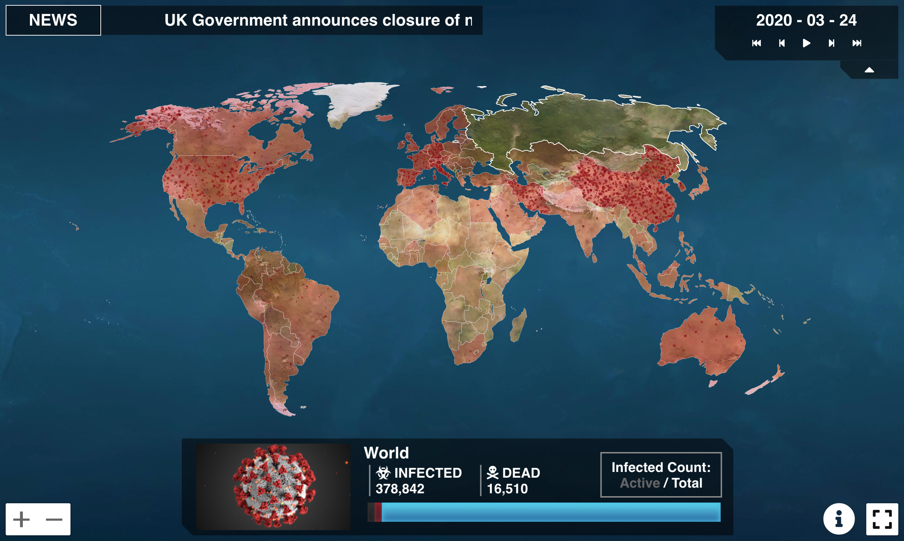
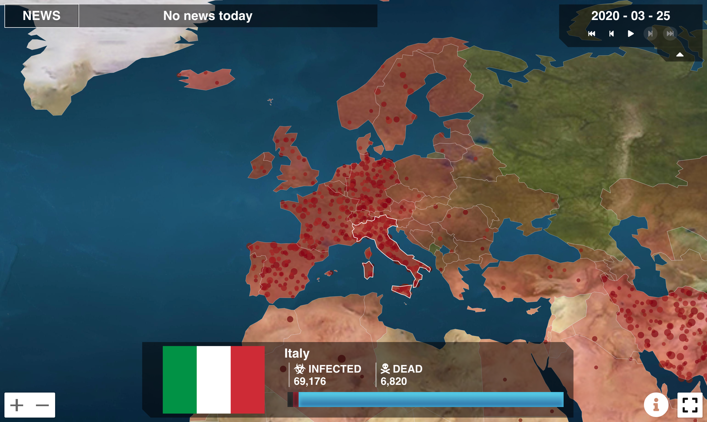
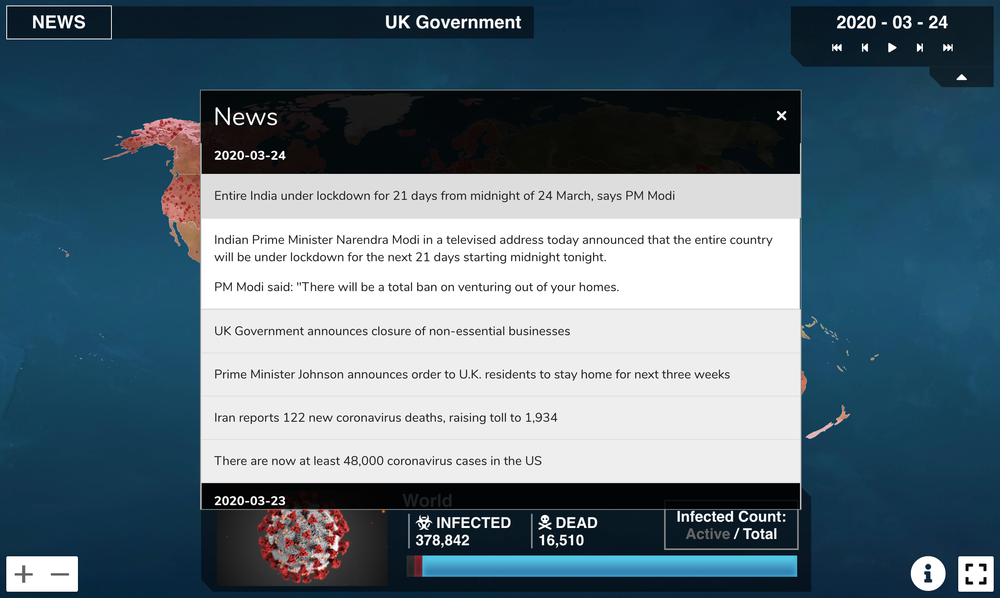

  

  <h1>COVID Inc.</h1>

## [Visit the site](https://covidinc.io)

With the rapidly-evolving COVID-19 outbreak, it can be hard to visualize how the situation in different countries is changing over time. COVID Inc. an interactive world map that visualizes the spread of the coronavirus outbreak over time on a Plague Inc. interface: a dashboard everyone is familiar with.
### Server Code: [GitHub Repo](https://github.com/Polunom/covid-inc-server)

# Features

- **History** - Rewind the clock by using the timeline controls to see the outbreak progression at different points in time. Click the play button to watch it evolve. 
- **News** - The site pulls the most up-to-date news and displays it on a scrolling headline. As you rewind through time, the news is automatically updated to that day.

# Screenshots

# Developing
* Install the latest version of [`Node.js`](https://nodejs.org/en/)
* Run `npm install` to install dependencies
* Start the server by running `npm run start`
* Navigate to `localhost:3000` on your web browser to see the site

# License

This project is licensed under the [MIT license](https://opensource.org/licenses). Feel free to fork this repository and play around with it! If you see any bugs with Covid Inc. or want to suggest a new feature, please feel free open an issue.
